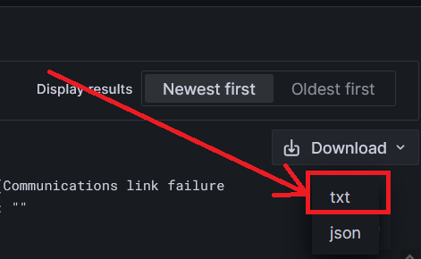
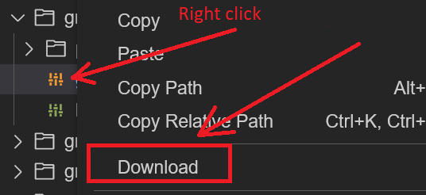

# Tasks on the topic Grafana Loki

## Task1 

In grafana:
1. Select all log lines starting from 2022-10-01 to 2022-12-31 in the `app.log` file where an error of type `ERROR` was thrown.
2. Save the resulting log lines in a txt format file named `result.txt`.

## Task2 

Modify the configuration in the Grafana config file `/etc/grafana/grafana.ini`.

1. Change default UI theme from `dark` to `light`.
2. Add header 'myHeader' that the server adds to each HTTP(S) responses,
   value in this header must be `User is: nameOfGrafanaUser. Host is: nameOfGrafanaHost`.
    -  Spaces do not matter, but periods, colons upper and lower case do.
    - `nameOfGrafanaUser` - Name of grafana user.
    - `nameOfGrafanaHost` - Name of host.
3. Save the modified config file `grafana.ini`.

Finally, push the `result.txt` and `grafana.ini` files to the GitHub repository.

Save file (hint):

from grafana

from the environment

P.S. You have access to [Grafana Loki](https://killercoda.com/online-marathon/course/Grafana_loki/Grafana_loki_task) playground. Otherwise, make sure you have a functional Grafana Loki instance configured.
